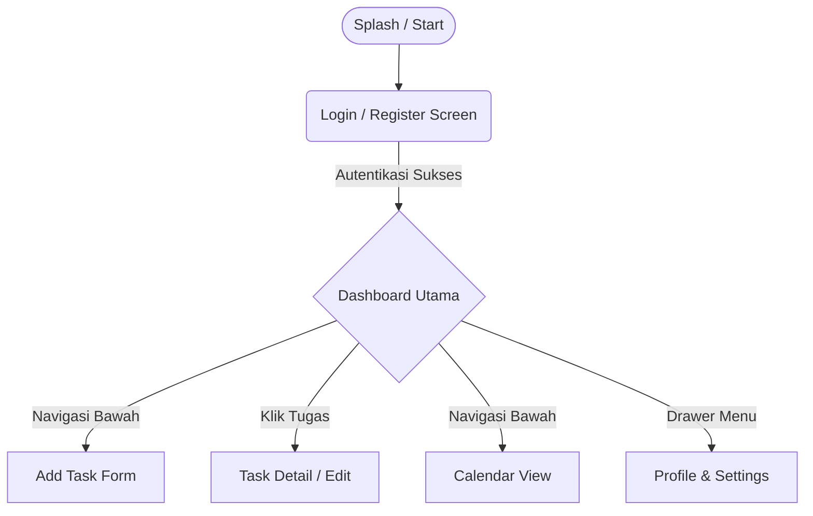
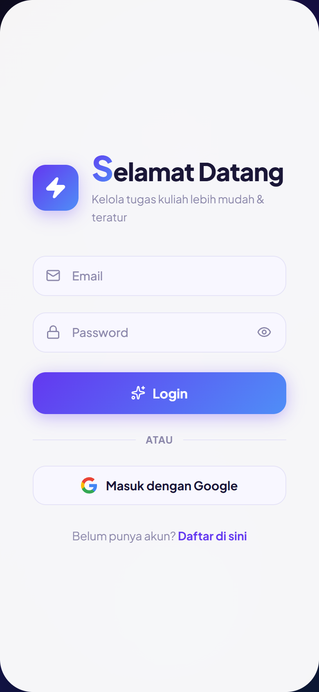
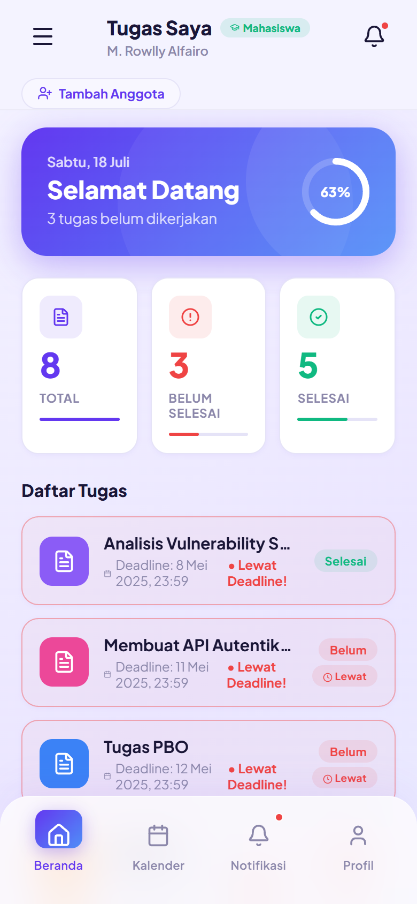
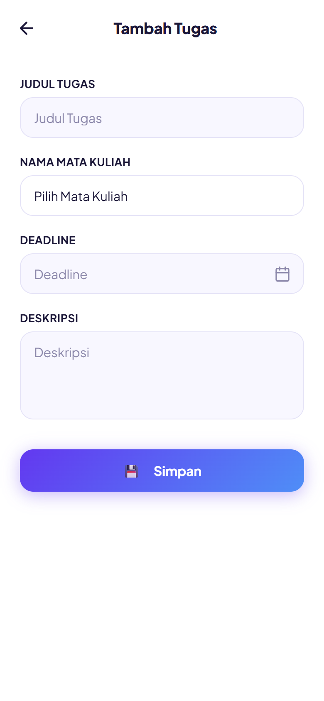
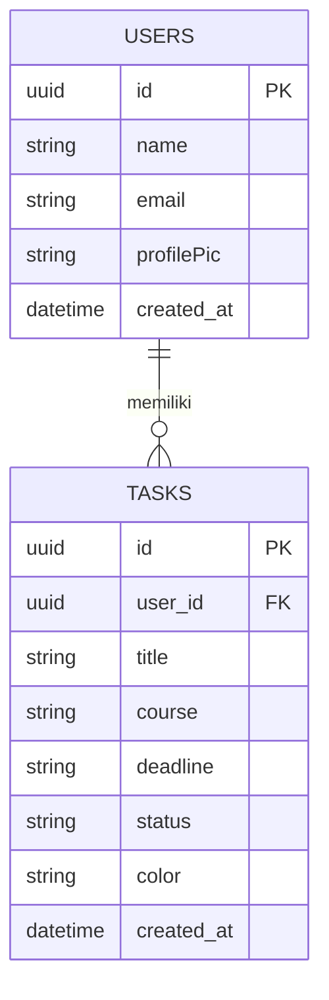

# Laporan Kemajuan (Milestone Report) Proyek Mobile Programming
**Nama Proyek:** Task Manager App

---

## 1. Analisis Permasalahan
**Latar Belakang & Kendala Nyata:**
- **Manajemen Waktu Mahasiswa/Pekerja:** Banyaknya tugas kuliah atau pekerjaan seringkali membuat seseorang kewalahan. Kendala utama yang sering dihadapi adalah lupa tenggat waktu (deadline), kurangnya skala prioritas, dan tidak adanya tempat terpusat untuk memantau kemajuan suatu pekerjaan.
- **Produktivitas Menurun:** Tanpa sistem pencatatan yang baik, tugas sering dikerjakan dengan sistem SKS (Sistem Ngebut Semalam) yang berdampak pada rendahnya kualitas hasil kerja dan tingginya tingkat stres.
- **Keterbatasan Aplikasi yang Ada:** Beberapa aplikasi manajemen tugas yang ada di pasaran terlalu kompleks untuk penggunaan sehari-hari atau kurang memiliki tampilan yang ramah dan interaktif (UI/UX kurang menarik).

---

## 2. Analisis Kebutuhan
**A. Kebutuhan Fungsional (Functional Requirements):**
1. **Sistem Autentikasi:** Pengguna dapat melakukan registrasi dan login.
2. **Manajemen Tugas (CRUD):** Pengguna dapat menambah, melihat, mengedit, dan menghapus tugas.
3. **Kategorisasi & Prioritas:** Pengguna dapat menandai tugas berdasarkan prioritas (Tinggi, Sedang, Rendah) dan status (Selesai/Belum).
4. **Profil Pengguna:** Terdapat halaman profil untuk mengubah foto dan detail pengguna (terintegrasi dengan UserContext).
5. **Personalisasi Tema (Settings):** Pengguna dapat mengubah bahasa (i18n) dan preferensi aplikasi.

**B. Kebutuhan Non-Fungsional (Non-Functional Requirements):**
1. **Responsivitas Tinggi:** Aplikasi harus dapat diakses dan berjalan lancar di berbagai perangkat (Mobile, Tablet, Desktop).
2. **Desain Antarmuka Modern:** Menggunakan animasi mikro, gradasi warna yang menarik, dan elemen desain yang responsif (memanfaatkan Tailwind CSS).
3. **Kinerja / Performa:** Waktu muat halaman (load time) yang cepat.

---

## 3. Referensi Desain, Survey & Observasi
- **Studi Banding:** Melakukan observasi terhadap aplikasi produktivitas populer seperti Todoist, Trello, dan Google Tasks. Dari observasi tersebut, disimpulkan bahwa pengguna lebih menyukai aplikasi dengan navigasi yang ringkas dan visualisasi tugas yang jelas (seperti card view atau list view).
- **Pendekatan Desain:** Mengadopsi prinsip Glassmorphism dan desain UI yang *clean*. Penggunaan ikon-ikon intuitif agar pengguna baru tidak perlu waktu lama untuk mempelajari aplikasi.

---

## 4. Timeline Pelaksanaan Proyek (Gantt Chart Simulation)
- **Minggu 1-2: Inisiasi & Analisis.** Penentuan ide, penyusunan kebutuhan fungsional & non-fungsional, observasi desain.
- **Minggu 3-4: Desain UI/UX & Wireframing.** Pembuatan sketsa alur layar (Low-fidelity) hingga desain High-fidelity menggunakan Figma.
- **Minggu 5-8: Pengembangan Front-end & Logic.** Setup project (Vite + React), implementasi UI/UX (Tailwind), integrasi navigasi, implementasi state management (Context API), dan i18n.
- **Minggu 9-10: Integrasi Backend & Database.** Setup endpoint, integrasi API, perancangan dan implementasi database.
- **Minggu 11-12: Testing & Evaluasi.** Uji coba performa, perbaikan bug, penyesuaian UX.
- **Minggu 13-14: Finalisasi & Rilis.** Penyusunan laporan akhir, demonstrasi, dan presentasi milestone.

---

## 5. Wireframe (Blueprint Alur Aplikasi)
Berikut adalah blueprint alur layar (flow) aplikasi dari pengguna membuka aplikasi hingga mengelola tugas:



- **Splash/Landing Screen:** Menampilkan logo dan tombol Login/Register.
- **Halaman Login/Register:** Form input email dan password.
- **Dashboard / Home:** Menampilkan ringkasan tugas (Task list, progress bar) dengan layout *Mobile-First*. Terdapat Bottom Navigation atau Sidebar untuk layar lebar.
- **Add Task Form:** Modal atau halaman terpisah untuk mengisi Judul Tugas, Deskripsi, Tanggal Jatuh Tempo, dan Prioritas.
- **Profile & Settings:** Menu pengaturan bahasa dan pengelolaan profil pengguna.

---

## 6. Desain Interface (High-Fidelity)
Aplikasi dikembangkan menggunakan React dan Tailwind CSS dengan pendekatan *modern aesthetic*. Berikut adalah *screenshot* UI asli aplikasi yang telah dibuat:

<div style="display: flex; gap: 10px; margin-bottom: 16px;">
  
  
  
</div>

- **Warna & Tipografi:** Menggunakan palet warna biru dan ungu (gradient) untuk kesan modern dan dinamis. Font modern (seperti Inter atau Poppins) untuk keterbacaan yang baik.
- **Komponen Interaktif:** Kartu tugas memiliki efek hover, *micro-animations* saat tugas ditandai selesai, serta layout yang sangat adaptif dari tampilan *smartphone* hingga desktop.

---

## 7. Hasil Coding (Demonstrasi Potongan Kode Inti)

**A. Struktur State Management (Context API untuk User):**
```javascript
// src/context/UserContext.jsx
import React, { createContext, useState, useEffect } from 'react';

export const UserContext = createContext();

export const UserProvider = ({ children }) => {
    const [user, setUser] = useState({
        name: 'User Mahasiswa',
        profilePic: null, // base64 image or URL
    });

    return (
        <UserContext.Provider value={{ user, setUser }}>
            {children}
        </UserContext.Provider>
    );
};
```

**B. Implementasi i18n (Internationalization):**
```javascript
// src/i18n.js
import i18n from 'i18next';
import { initReactI18next } from 'react-i18next';
// ... import resources ...

i18n.use(initReactI18next).init({
    resources: {
        en: { translation: { greeting: "Hello" } },
        id: { translation: { greeting: "Halo" } }
    },
    lng: "id",
    fallbackLng: "en",
    interpolation: { escapeValue: false }
});
```

---

## 8. Rancangan Database (Skema ERD)
Aplikasi dirancang dengan relasi sederhana menggunakan relasi 1-ke-Banyak (1-to-N) antara Pengguna dan Tugas.



**Tabel `users`**
- `id` (PK) - UUID
- `name` - Varchar
- `email` - Varchar
- `profilePic` - Varchar (URL/Base64)
- `created_at` - Timestamp

**Tabel `tasks`**
- `id` (PK) - UUID
- `user_id` (FK) -> `users.id`
- `title` - Varchar
- `course` - Varchar
- `deadline` - Varchar
- `status` - Varchar ('pending', 'done')
- `color` - Varchar
- `created_at` - Timestamp

**Relasi:**
Satu `User` memiliki banyak `Tasks` (1:N). Setiap `Task` hanya dimiliki oleh satu `User`.
